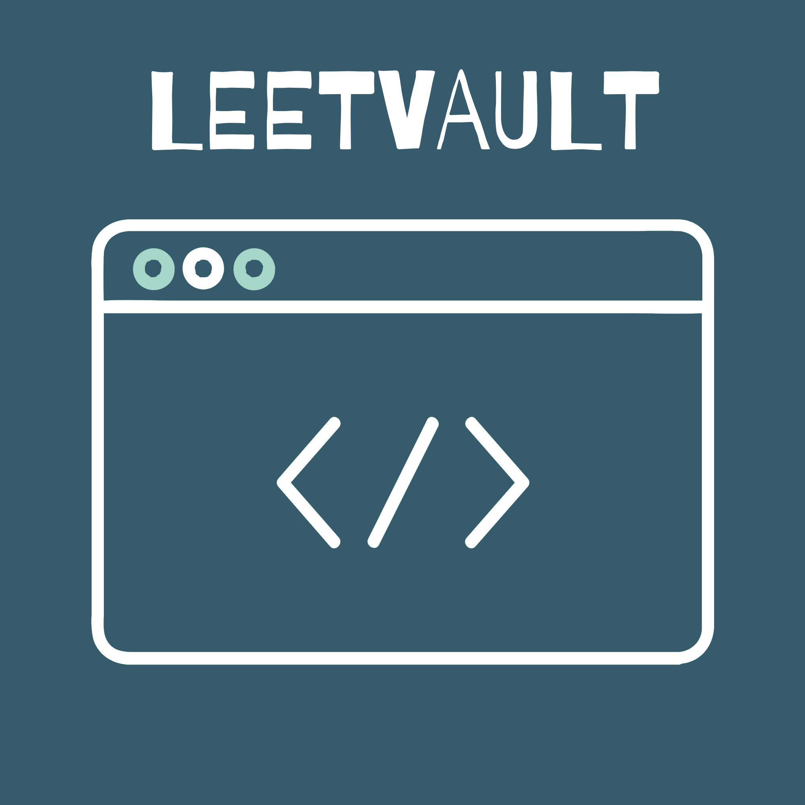
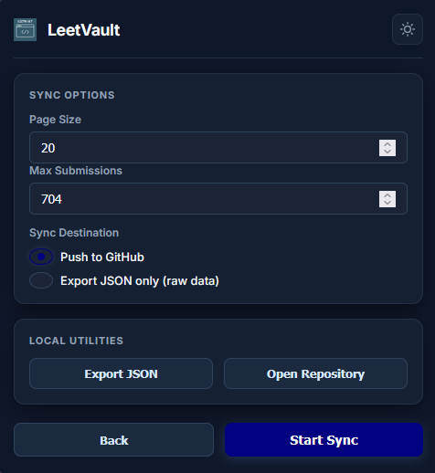
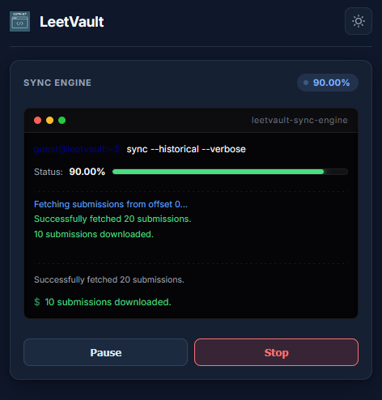
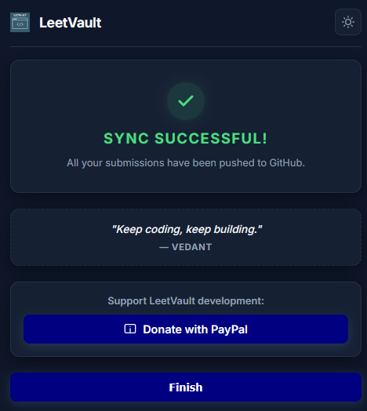
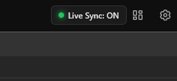

# LeetVault 

<p align="center">
    
</p>

**Solved on LeetCode, saved to GitHub — automatically.**

LeetVault is a browser extension that watches your LeetCode submissions and keeps a clean, organized, auto-documented archive of them on GitHub. No more manually copy-pasting solutions into a repo after every submit — solve the problem, and LeetVault takes care of the rest.

## Sync Option



## Sync Engine 



## Success!



### Live Sync Widget 


---

## Why I built this

I kept solving problems on LeetCode and telling myself "I'll push this to GitHub later" — and later never came. LeetVault removes that friction entirely. It sits quietly in the background, and the moment a submission is accepted, it organizes the code, writes a README for that problem, and commits it to your repo.

## Note on Code & Design

> [!NOTE]
> - **AI-Generated Comments**: Many of the code comments across the repository were generated with the help of AI, so you may find some explanations phrased in a machine-like way or structured differently than standard hand-written comments.
> - **Design Aesthetics**: Since I don't know professional designing, the UI design and layout were created using AI to achieve a polished, modern look. As a result, the styling and layout may have a distinct AI-designed aesthetic.

## Features

- **Live Sync** — the moment a submission is marked `Accepted`, LeetVault detects it and shows a small on-page prompt: *"New submission detected"*, with **Sync now** / **Skip** buttons and an editable commit message. If you don't respond within 10 seconds, it syncs automatically — no need to babysit it.
- **Historical Sync** — pulls your entire submission history in one go (paginated, with automatic cooldowns to respect LeetCode's rate limits) and builds out a full repository from scratch.
- **Smart de-duplication** — if you've solved a problem in multiple languages, or resubmitted it a dozen times, LeetVault only keeps the best (accepted) submission per language, per problem.
- **Auto-generated documentation** — every problem gets its own `README.md` with difficulty, tags, runtime/memory, your notes, and a table of solution files. The repo root gets a summary README with badges, a stats table, a topic-wise index, and a "recently solved" feed.
- **Multi-language support** — solutions in C++, Python, Java, Go, Rust, SQL, and more are named and organized automatically, with collision-safe filenames when you solve the same problem in more than one language.
- **Metadata straight from LeetCode** — difficulty, topic tags, and problem IDs are pulled via LeetCode's GraphQL API and cached locally so repeat syncs are fast.
- **JSON export** — export your raw submission dump or the fully processed repository as JSON, no GitHub required.
- **Live progress UI** — a compiler-style progress ring shows exactly what's happening during a historical sync, with pause/resume/stop controls.

## How it works

1. You connect your GitHub account (OAuth, one click).
2. LeetVault reads your LeetCode session cookies (locally, never sent anywhere except LeetCode's own API) to fetch your submissions.
3. Submissions are grouped by problem, deduplicated per language, and enriched with difficulty/tags from LeetCode's GraphQL endpoint.
4. Solution files + per-problem READMEs + a root README are generated.
5. Everything is pushed to your chosen GitHub repo as a single commit using GitHub's Git Data API (so historical syncs don't spam your commit history with hundreds of individual file commits).

## Installation (for development / unpacked install)

LeetVault is not on the app stores yet, so for now it runs as an unpacked extension:

1. Clone this repo.
2. Make sure the folder structure looks like this:
   ```
   leetvault/
   ├── manifest.json
   ├── CORE/
   │   ├── core.js
   │   ├── metadata.js
   │   ├── generator.js
   │   ├── readme.js
   │   └── exporter.js
   ├── GITHUB/
   │   └── github.js
   ├── LEETCODE/
   │   ├── content-script.js
   │   ├── sync.js
   │   ├── popup.js
   │   ├── popup.html
   │   └── popup.css
   ├── background/
   │   └── background.js
   ├── assets/
   │   └── icons/
   └── firefox/
       └── ... (Firefox Manifest V3 compatible build)
   ```

### Loading in Chrome
3. Go to `chrome://extensions`, enable **Developer mode**, and click **Load unpacked**. Select the root `leetvault/` folder.
4. Pin the extension and open it from any LeetCode problem page.

### Loading in Firefox
3. Go to the URL `about:debugging#/runtime/this-firefox`.
4. Click on the **Load Temporary Add-on...** button.
5. Select the `manifest.json` file inside the `firefox/` folder.

## GitHub OAuth setup

GitHub's OAuth flow needs a client secret, which can never live inside extension code (anyone could extract it). Because of that, you'll need:

1. A GitHub OAuth App (create one under **GitHub → Settings → Developer settings → OAuth Apps**). Set its callback URL to the value Chrome gives you from `chrome.identity.getRedirectURL()` (logged to the console the first time you try to log in).
2. A tiny serverless proxy (a Cloudflare Worker or Vercel function works great) that exchanges the OAuth `code` for an `access_token` using your client secret, and returns `{ access_token }`.
3. Drop your OAuth App's client ID and your proxy's URL into `GITHUB/github.js` (`clientId` and `tokenExchangeUrl`).

## Permissions, and why they're needed

| Permission | Why |
|---|---|
| `cookies` | Reads your LeetCode session cookie to call LeetCode's own API on your behalf |
| `storage` | Saves your settings, GitHub token, and cached problem metadata locally |
| `identity` | Handles the GitHub OAuth login flow |
| `webNavigation` | Detects the submission ID right after you hit submit |
| `alarms` | Keeps the background service worker alive during long historical syncs |
| `downloads` | Lets you export your data as a JSON file |
| `activeTab` | Talks to the LeetCode tab you're currently on |

## Tech stack

Plain JavaScript, Manifest V3, `chrome.storage` for persistence, GitHub's REST + Git Data APIs for commits, and LeetCode's own GraphQL endpoint for problem metadata. No build step, no frameworks — just modular scripts.

## Disclaimer

LeetVault is an independent project and isn't affiliated with, endorsed by, or connected to LeetCode in any way. It only reads data your own account already has access to.

## Contributing

Issues and PRs are welcome. If you're adding a new language mapping, it just needs an entry in `Core.languageMap` and `Readme.languageNames`.

## License

MIT
